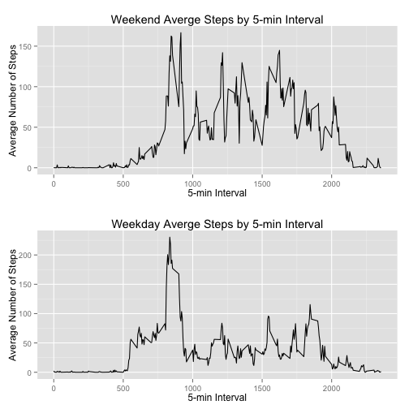

## Loading and preprocessing the data
First we'll load the data and have a look.

```r
rawActivity <- read.csv("activity.csv")
head(rawActivity)
```

```
##   steps       date interval
## 1    NA 2012-10-01        0
## 2    NA 2012-10-01        5
## 3    NA 2012-10-01       10
## 4    NA 2012-10-01       15
## 5    NA 2012-10-01       20
## 6    NA 2012-10-01       25
```

For the sake of this part of the analysis we'll remove the NAs and make sure the "date" variable is of the correct class.

```r
activity <- rawActivity[complete.cases(rawActivity), ]
activity$date <- as.Date(activity$date)
```

##What is mean total number of steps taken per day?
###1. Make a histogram of the total number of steps taken each day.

```r
activitySumDay <- aggregate(activity$steps, by = list(activity$date), FUN = sum)
colnames(activitySumDay) <- c("date", "totalSteps")
hist(activitySumDay$totalSteps, xlab = "Number of Steps", ylab = "Frequency", main = "Histogram of Number of Steps By Day", breaks = 26, col = c("blue"))
```

 

###2. Calculate and report the mean and median total number of steps taken per day

```r
mean(activitySumDay$totalSteps)
```

```
## [1] 10766.19
```

```r
median(activitySumDay$totalSteps)
```

```
## [1] 10765
```

##What is the average daily activity pattern?

###1. Make a time series plot (i.e. type = "l") of the 5-minute interval (x-axis) and the average number of steps taken, averaged across all days (y-axis)

```r
library(ggplot2)
```

```
## Use suppressPackageStartupMessages to eliminate package startup messages.
```

```r
meanSteps <- aggregate(activity$steps, by = list(activity$interval), FUN = mean)
colnames(meanSteps) <- c("interval", "avgSteps")
qplot(interval, avgSteps, data = meanSteps, geom = "line", xlab = "5-min Interval", ylab = "Average Number of Steps")
```

 

###2. Which 5-minute interval, on average across all the days in the dataset, contains the maximum number of steps?

```r
meanSteps[meanSteps$avgSteps == max(meanSteps$avgSteps), ]
```

```
##     interval avgSteps
## 104      835 206.1698
```

## Imputing Missing Values
###1) Calculate and report the total number of missing values in the dataset (i.e. the total number of rows with NAs)
For this we have to return to the raw data set and subset by the NA values.

```r
length(rawActivity$steps[is.na(rawActivity$steps)])
```

```
## [1] 2304
```

###2) Devise a strategy for filling in all of the missing values in the dataset. The strategy does not need to be sophisticated. For example, you could use the mean/median for that day, or the mean for that 5-minute interval, etc.
In this case, I thought it would make the most sense to replace the missing data with the mean steps value for that particular 
5-min interval.  To do this, I'll start by merging the raw data with the mean data, by interval.

```r
library(data.table)
```

```
## data.table 1.9.4  For help type: ?data.table
## *** NB: by=.EACHI is now explicit. See README to restore previous behaviour.
```

```r
meanFillDT <- as.data.table(meanSteps)
rawDT <- data.table(rawActivity, key = c("steps", "date", "interval"))
rawDT$date <- as.Date(rawDT$date)
replaceActivity <- merge(meanFillDT, rawDT, by = "interval")
replaceActivity1 <- merge(meanFillDT, rawDT, by = "interval")
```


###3) Create a new dataset that is equal to the original dataset but with the missing data filled in.
I chose to construct a simple loop to find and replace the steps NA value with the average value for that interval.

```r
for (i in 1:nrow(replaceActivity)) {
  if (is.na(replaceActivity$steps[i]) == TRUE) {
    replaceActivity$steps[i] <- replaceActivity$avgSteps[i]
  }
}
head(replaceActivity)
```

```
##    interval avgSteps    steps       date
## 1:        0 1.716981 1.716981 2012-10-01
## 2:        0 1.716981 1.716981 2012-10-08
## 3:        0 1.716981 1.716981 2012-11-01
## 4:        0 1.716981 1.716981 2012-11-04
## 5:        0 1.716981 1.716981 2012-11-09
## 6:        0 1.716981 1.716981 2012-11-10
```

Secondary approach, which instead uses a conditional index and is much more efficient. 

```r
replaceActivity1$steps[is.na(replaceActivity1$steps) == TRUE] <- replaceActivity1$avgSteps[is.na(replaceActivity1$steps) == TRUE]
```
###4) Make a histogram of the total number of steps taken each day and Calculate and report the mean and median total number of steps taken per day. 
###Do these values differ from the estimates from the first part of the assignment? 
###What is the impact of imputing missing data on the estimates of the total daily number of steps?

```r
activitySumDayNew <- aggregate(replaceActivity$steps, by = list(replaceActivity$date), FUN = sum)
colnames(activitySumDayNew) <- c("date", "totalSteps")
hist(activitySumDayNew$totalSteps, xlab = "Number of Steps", ylab = "Frequency", main = "Histogram of Number of Steps By Day", breaks = 26, col = "blue")
```

 

```r
##New mean and median
mean(activitySumDayNew$totalSteps)
```

```
## [1] 10766.19
```

```r
median(activitySumDayNew$totalSteps)
```

```
## [1] 10766.19
```

Compared to the original mean and median calculations, the new "adjusted" mean and median are about the same. The bars flatten out when compared to the original, as the data converges around the mean.

##Are there differences in activity patterns between weekdays and weekends?
###1) Create a new factor variable in the dataset with two levels – “weekday” and “weekend” indicating whether a given date is a weekday or weekend day.

```r
replaceActivity[, dayOfWeek := ifelse(as.factor(weekdays(replaceActivity$date, abbreviate = TRUE)) %in% c("Sat", "Sun"), "weekend", "weekday")]
```

```
##        interval avgSteps     steps       date dayOfWeek
##     1:        0 1.716981  1.716981 2012-10-01   weekday
##     2:        0 1.716981  1.716981 2012-10-08   weekday
##     3:        0 1.716981  1.716981 2012-11-01   weekday
##     4:        0 1.716981  1.716981 2012-11-04   weekend
##     5:        0 1.716981  1.716981 2012-11-09   weekday
##    ---                                                 
## 17564:     2355 1.075472  0.000000 2012-11-28   weekday
## 17565:     2355 1.075472  0.000000 2012-11-29   weekday
## 17566:     2355 1.075472  8.000000 2012-10-19   weekday
## 17567:     2355 1.075472 20.000000 2012-10-09   weekday
## 17568:     2355 1.075472 29.000000 2012-10-17   weekday
```

###2) Make a panel plot containing a time series plot (i.e. type = "l") of the 5-minute interval (x-axis) and the average number of steps taken, averaged across all weekday days or weekend days (y-axis).

```r
meanStepsWeekend <- aggregate(replaceActivity$steps, by = list(replaceActivity$interval), FUN = mean)

weekdaySteps <- replaceActivity[replaceActivity$dayOfWeek == "weekday", ]
weekendSteps <- replaceActivity[replaceActivity$dayOfWeek == "weekend", ]

weekdayMean <- as.data.frame(aggregate(weekdaySteps$steps, by = list(weekdaySteps$interval), FUN = mean))
colnames(weekdayMean) <- c("interval", "steps")

weekendMean <- as.data.frame(aggregate(weekendSteps$steps, by = list(weekendSteps$interval), FUN = mean))
colnames(weekendMean) <- c("interval", "steps")

library(gridExtra)
```

```
## Loading required package: grid
```

```r
q1 <- qplot(interval, steps, data = weekendMean, geom = "line", xlab = "5-min Interval", ylab = "Average Number of Steps", main = "Weekend Averge Steps by 5-min Interval")
q2 <- qplot(interval, steps, data = weekdayMean, geom = "line", xlab = "5-min Interval", ylab = "Average Number of Steps", main = "Weekday Averge Steps by 5-min Interval")
grid.arrange(q1, q2, nrow = 2)
```

 

With the above graphs you can make clear distinctions in activity across the 24-hour period in the day, with weekends typically showing more activity from 1700-2100. Intuitively, this follows. The typical difference in personal routine between a weekday and weekend day accounts for this pattern - folks are going out on the weekends. 

